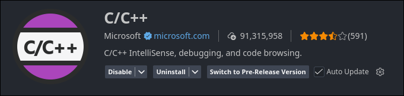
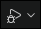
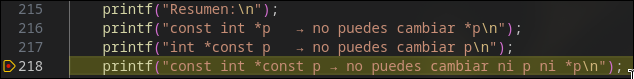
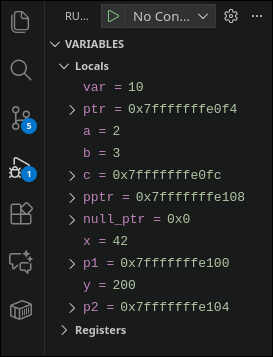
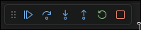

# Como debuggear

La explicación de como debuggear se hará para VSCode. Se puede usar cualquier otro IDE, este es el que a mi me gusta.


## Linux

Lo primero, es verificar que tenemos el compilador y el debugger instalados. Usaremos gcc y gdb. Si no los tenemos, lo instalamos.

``` bash
gcc --version
gdb --version
```

La salida debe ser similar a la siguiente:
```
gcc (GCC) 15.2.1 20251112
Copyright (C) 2025 Free Software Foundation, Inc.
This is free software; see the source for copying conditions.  There is NO
warranty; not even for MERCHANTABILITY or FITNESS FOR A PARTICULAR PURPOSE.

GNU gdb (GDB) 16.3
Copyright (C) 2024 Free Software Foundation, Inc.
License GPLv3+: GNU GPL version 3 or later <http://gnu.org/licenses/gpl.html>
This is free software: you are free to change and redistribute it.
There is NO WARRANTY, to the extent permitted by law.
```

## Windows

En Windows, el proceso es similar, pero necesitamos instalar un compilador y un debugger compatibles con VSCode. La opción más sencilla es MinGW-w64, que incluye `gcc` y `gdb`.

Primero debemos instalar MingW-w64, desde su página oficial. [https://github.com/gorvgoyl/MinGW64/releases](https://github.com/gorvgoyl/MinGW64/releases)

Descargas el último zip, el más actual, y lo descomprimes en `C:`.

Una vez hecho lo anterior, debes añadirlo al path. Busca "Editar variables de entorno", y en "Variables del sistema", y en path le das a "editar" y "nuevo", y añades `C:\mingw64\bin`. Mi recomendación es que lo añadas arriba y abajo, es decir, en el path del usuario y del sistema. 

Para verificar la instalación, ejecuta:
```powershell
gcc --version
gdb --version
```
Debes tener una salida similar a la siguiente
```
gcc.exe (Rev10, Built by MSYS2 project) 13.1.0
gdb (GDB) 13.2
```


## Uso del debugger

Una vez tenemos esto, podemos abrir VSCode. En las extensiones, buscamos `C/C++`, y la instalamos.


Si todo ha salido bien, cuando esteamos en un archivo de C, tenemos arriba a la derecha lo siguiente:


Ahora, podemos darle a Run y ejecutar el programa de forma normal, o podemos Debuggear.

Antes de empezar a debuggear, debemos poner breakpoints:



El breakpoint es el punto rojo que está a la izquierda del número 218.
Esto significa que el programa se detendrá aqui durante su ejecución como si lo pausáramos. Con esto, podemos ver en el panel de debug, información importante.



Una vez que alcanzamos el breakpoint, y el programa se pausa, podemos avanzar línea por línea. En la barra de menú que sale arriba, tenemos varias opciones.



Los importantes son los 3 primeros.
- El **continue**, correspondiente a F5, es para reanudar la ejecución normal del programa, hasta el final, o hasta el siguiente breakpoint de haberlo.
- El **step over**, correspondiente a F10, pasa a la siguiente línea de código, una por una.
- El **step into**, correspondiente a F11, permite si la línea es una función, entrar dentro de la función, para poder pasar la función línea por línea, a diferencia de step over, que la ejecutaría entera.